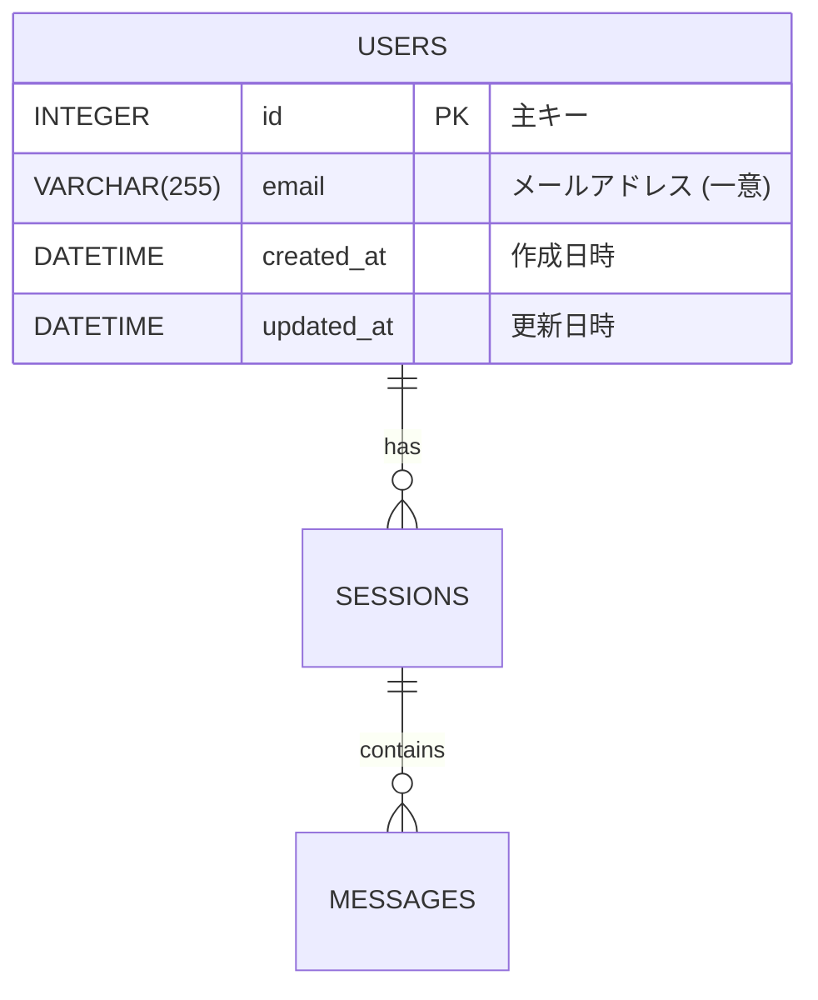

# DB設計書テンプレート

本テンプレートは `project-design-guide` スキルがDB設計書を生成する際の構成ガイドラインである。
参照元: `Sakura Rin/docs/phase1_database_design.md`

---

## 必須セクション

### 1. 永続化層の技術選定

以下の判断ポイントを明示する:

- **RDB vs NoSQL**: プロジェクトの要件に基づく判断理由
  - RDBが適する場合: データ間の関係性が明確、JOINが必要、ACID特性が重要、複雑なクエリが予想される
  - NoSQLが適する場合: スキーマレスな柔軟性が必要、大量の読み書き、水平スケーリング優先
- **具体的なDB製品の選定**: PostgreSQL / MySQL / MongoDB 等の選定理由
- **開発フロー**: ローカル開発→本番環境への移行計画
- **ORM選定**: SQLAlchemy / Prisma / TypeORM 等の選定と理由

教育コメント例:
```markdown
> **なぜこうしたか？**
> 今回のプロジェクトでは、ユーザーとセッションと会話履歴の間に明確な親子関係があります。
> このような「エンティティ間の関係性」を扱うのはRDB（リレーショナルデータベース）が得意です。
> NoSQL（例: MongoDB）はスキーマが柔軟で開発初速は速いですが、
> 複数テーブルを横断するデータ分析や、データの整合性保証はRDBが圧倒的に強いです。

> **もっと学ぶなら:**
> - 「RDB NoSQL 違い 選び方」で検索すると比較記事が見つかります
> - SQLの基礎: 「プロになるためのWeb技術入門」が網羅的で分かりやすいです
```

### 2. ER図

Mermaid `erDiagram` で記述する。

記述ルール:
- テーブル間のリレーション（1対多、多対多）を明示
- 各カラムに型とPK/FK/説明を付与
- 日本語の説明を `"..."` で囲んで付記

例:


### 3. テーブル定義

テーブルごとに以下を記述:
- テーブル名と目的（1行説明）
- カラム定義を表形式で:

| カラム名 | 型 | 説明 | 制約 |
|:---|:---|:---|:---|
| `id` | `INTEGER` | 主キー | PRIMARY KEY, AUTO_INCREMENT |
| `created_at` | `DATETIME` | 作成日時 | NOT NULL, DEFAULT NOW() |

- 各テーブルの設計判断を教育コメントで補足

### 4. インデックス設計（必要な場合）

- よく検索されるカラムにインデックスを設定
- 複合インデックスの設計意図を説明

### 5. マイグレーション方針

- マイグレーションツールの選定（Alembic, Prisma Migrate 等）
- バージョン管理の方法
- ロールバック方針

---

## 教育コメントの挿入ポイント

| セクション | 教育コメントの例 |
|:---|:---|
| 1. 技術選定 | なぜRDB/NoSQLを選んだか、ORM選定理由 |
| 2. ER図 | リレーションの種類（1対多 vs 多対多）の意味 |
| 3. テーブル定義 | なぜ `created_at`/`updated_at` を全テーブルに入れるか |
| 3. テーブル定義 | なぜ VARCHAR の長さを指定するか |
| 3. テーブル定義 | 主キーに AUTO_INCREMENT を使う理由 |
| 4. インデックス | インデックスの仕組みと「貼りすぎると遅くなる」理由 |
| 5. マイグレーション | なぜ手動SQLではなくマイグレーションツールを使うか |

## 共通カラム（全テーブルに含めることを推奨）

| カラム名 | 型 | 説明 | 理由 |
|:---|:---|:---|:---|
| `id` | `INTEGER` | サロゲートキー | ビジネスキーの変更に強い |
| `created_at` | `DATETIME` | レコード作成日時 | デバッグ・監査に必須 |
| `updated_at` | `DATETIME` | レコード更新日時 | データ鮮度の確認に必要 |
